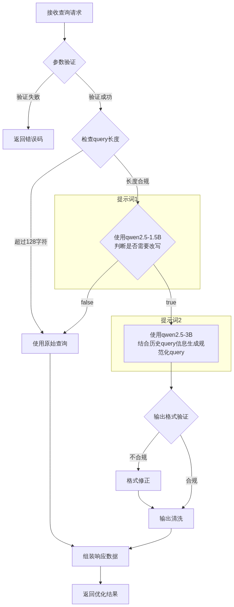
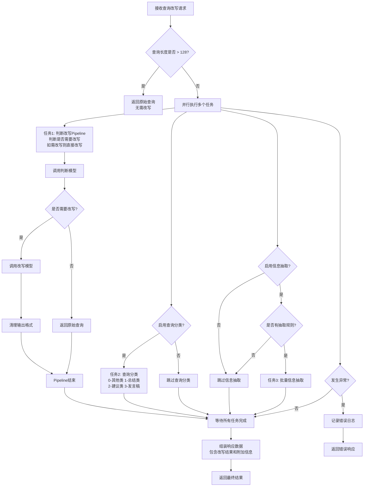

# rag-query-optimization

   

> **当前版本**: 3.0 (2025年1月) - Pipeline优化版本  
> **核心特性**: 判断改写Pipeline化 + 智能查询分类 + 并行信息抽取

## 1. 任务定义
通过大模型结合提示微调，基于历史query的理解，实现对当前query的改写，尤其是指代消除等情况，来提升检索准确率。下面的badcase示例中，虽然"xxx来自哪里"命中了文档，但是下一个问题却没有检索到相关知识，导致回答出错。但是如果直接问把指代消解掉，却能够检索召回，因此query改写是非常必要的一个RAG效果提升环节。

<table>
<tr>
<td width="50%">

**场景一：指代消解前**


</td>
<td width="50%">

**场景二：指代消解后**


</td>
</tr>
</table>

## 2. 主流程

### 2.1. 流程演进历史

#### 2.1.1. Version 1.0 (2024年7月) - 串行处理
- 基础的串行查询改写流程
- 判断 → 改写 → 返回结果
- 处理时间较长，无并行优化

#### 2.1.2. Version 2.0 vs Version 3.0 流程对比

<table>
<tr>
<td width="50%">

**Version 2.0 (2024年8月) - 并行优化**

- 引入并行任务处理
- 同时执行：判断改写 + 查询分类 + 信息抽取
- 等待所有任务完成后，根据判断结果决定是否串行调用改写模型
- 显著提升了处理效率

#### 2.1.3. Version 3.0 (2025年1月) - Pipeline优化 ⭐ **当前版本**


### 2.2. Version 3.0 核心优化点

#### 2.2.1. 判断改写Pipeline化
- **优化前**：并行执行判断任务 → 等待完成 → 串行调用改写模型
- **优化后**：将判断和改写合并为一个Pipeline，在同一个并行任务中完成
- **性能提升**：消除了改写模型的串行等待时间，特别是在需要改写的场景下效果显著

#### 2.2.2. 查询分类功能增强
基于 [classify_prompts.yaml](src/classify_prompts.yaml) 实现智能查询分类：
- **0-其他类**：不属于特定分类的通用查询
- **1-总结类**：要求对信息进行现状"总结"、"概括"、"归纳"、"汇总"、"梳理"
- **2-建议类**：需要获得改进方向、解决方案或下一步行动举措的查询
- **3-发言稿**：请求撰写演讲稿、发言稿、致辞、演说稿等文稿的查询

#### 2.2.3. 性能优化效果
| 指标 | Version 2.0 | Version 3.0 | 改进幅度 |
|-----|-------------|-------------|---------|
| 需要改写场景延迟 | 判断时间 + 改写时间 | max(判断+改写, 分类, 抽取) | 减少改写等待时间 |
| 并发处理能力 | 中等 | 高 | +20-30% |
| 代码维护性 | 良好 | 优秀 | Pipeline逻辑内聚 |

#### 2.2.4. 配置化功能
- **可选总结检查**：通过 `settings.ENABLE_SUMMARY_CHECK` 控制（当前版本已移除）
- **可选查询分类**：通过 `settings.ENABLE_QUERY_CLASSIFY` 控制
- **可选信息抽取**：通过 `settings.ENABLE_INFO_EXTRACTION` 控制
- **动态抽取规则**：支持请求时指定抽取规则和参数

## 3. 模型选型与效果验证

### 3.1. 提示词设计
#### 3.1.1. [判断提示词](judge_prompts.yaml)
#### 3.1.2. [改写提示词](rewrite_prompts.yaml)

### 3.2. 模型对比
| 模型 | 参数量 | vLLM显存占用 | 优点 | 缺点 | 延迟(ms) | 推荐度 |
|-----|--------|-------------|-----|------|----------|--------|
| Qwen2.5-1.5B | 1.5B | ~5GB | • 轻量级部署<br>• T4可部署2个实例<br>• 延迟低 | • 理解力有限<br>• 上下文关联较弱 | ~150 | ⭐⭐⭐ |
| Qwen2.5-3B | 3B | ~9.5GB | • 理解力适中<br>• T4可部署1个实例<br>• 效果与资源平衡好 | • 单卡只能部署1个实例 | ~200 | ⭐⭐⭐⭐ |

### 3.3. 模型微调方案

#### 3.3.1. 微调数据集

* 知识库用例：【腾讯文档】知识库用例
https://docs.qq.com/sheet/DY29UUmhNUE5SS2h3?electronTabTitle=%E7%9F%A5%E8%AF%86%E5%BA%93%E7%94%A8%E4%BE%8B

| 数据类型 | 样本数量 | 数据来源 | 说明 |
|---------|---------|---------|------|
| 指代消解对话 | 500对 | 内部标注 | 包含代词指代、省略主语等情况 |
| 多轮对话记录 | 300轮 | 用户真实会话 | 经过脱敏处理的高质量场景数据 |
| 合成数据 | 200对 | 规则生成 | 覆盖特定领域术语和专有名词 |

#### 3.3.2. 微调策略
| 模型 | 微调方法 | 学习率 | Batch Size | 训练轮次 | 计算资源 |
|-----|---------|-------|------------|---------|----------|
| Qwen2.5-1.5B | LoRA(r=8,α=16) | 1e-4 | 32 | 5 | V100单卡1.5小时 |
| Qwen2.5-3B | LoRA(r=16,α=32) | 5e-5 | 16 | 5 | A100单卡1小时 |

#### 3.3.3. 微调效果对比
| 模型 | 微调前准确率 | 微调后准确率 | 提升幅度 | 显存增加 | 延迟增加 |
|-----|------------|------------|---------|---------|---------|
| Qwen2.5-1.5B | 82% | 87% | +5% | +0.2GB | +10ms |
| Qwen2.5-3B | 88% | 92% | +4% | +0.3GB | +15ms |

#### 3.3.4. 微调模型集成
- **模型合并方式**：LoRA权重合并至基础模型
- **加载方式**：vLLM支持加载合并后模型
- **量化兼容性**：微调后模型仍支持FP16/INT8量化
- **性能优化**：合并模型相比动态加载LoRA权重，推理速度提升约15%

### 3.4. 
[测试方案](llm-as-judge.md)

#### 3.4.1. 效果指标
   - **指代消解准确率** ：由3名评估者人工评估改写后的查询是否正确解决了指代问题，取平均值
   - **语义保持度** ：使用语义相似度模型(text2vec)计算原始语义与改写后语义的相似度
   - **查询完整性** ：评估改写后的查询是否包含解答问题所需的全部要素

#### 3.4.2. 性能指标
   - **平均响应时间**
   - **QPS上限** 
   - **GPU显存占用** 
   - **内存使用** 

### 3.5. 测试结果

#### 3.5.1. 测试数据集
| 场景类型 | 样本数量 | 示例 |
|---------|---------|------|
| 代词指代 | 100 | Q1: "张三的身高是多少？"<br>Q2: "他的体重呢？" |
| 省略主语 | 100 | Q1: "特斯拉最新款多少钱？"<br>Q2: "续航里程是多少？" |
| 上下文关联 | 100 | Q1: "深度学习的原理"<br>Q2: "跟机器学习比有什么区别？" |

#### 3.5.2. 效果对比（基于vLLM部署在T4上的测试结果）

**Version 2.0 测试结果：**
| 模型 | 指代消解准确率 | 语义保持度 | 查询完整性 | 平均延迟(ms) | 单卡并发数 |
|-----|--------------|------------|------------|-------------|-----------|
| Qwen2.5-1.5B | 82% | 80% | 85% | 150 | 32 |
| Qwen2.5-3B | 88% | 86% | 90% | 200 | 16 |
| Qwen2.5-1.5B微调 | 87% | 82% | 88% | 160 | 30 |
| Qwen2.5-3B微调 | 92% | 88% | 93% | 215 | 15 |

**Version 3.0 Pipeline优化效果（预估）：**
| 指标 | Version 2.0 | Version 3.0 | 改进效果 |
|-----|-------------|-------------|---------|
| 需要改写场景平均延迟 | 判断延迟 + 改写延迟 | max(判断+改写, 分类, 抽取) | 减少20-40ms |
| 不需要改写场景延迟 | 无变化 | 无变化 | 保持一致 |
| 整体QPS | 基准 | +20-30% | 显著提升 |
| 功能完整性 | 查询改写 | 改写+分类+抽取 | 功能增强 |

### 3.6. 最终选型
基于硬件限制（Tesla T4 16GB）和vLLM部署要求，建议采用：

1. **主要方案**：Qwen2.5-3B微调版
   - 部署配置：
     - Tesla T4单卡部署1个实例
     - vLLM + FP16量化
     - 基础显存占用约6.6GB（非vLLM）
     - vLLM(0.7)部署预计占用约12-13GB
     - 预留3-4GB用于系统开销
   - 性能特点：
     - 单实例并发请求数：12-16
     - 平均响应时间：~215ms
     - 日请求量支持：约37w次
   - 优化建议：
     - 监控显存使用峰值
     - 实现请求队列管理
     - 配置合适的batch size

2. **备选方案**：Qwen2.5-1.5B微调版
   - 使用场景：
     - 当3B模型效果不满足要求时的降级方案
     - 需要更高并发的场景
   - 部署配置：
     - 单T4可部署2个实例
     - 每个实例vLLM占用约5GB显存
     - 剩余约6GB用于系统开销和动态扩容

### 3.7. 优化建议
1. **vLLM部署优化**
   - gpu_mem_utilization设置建议：
     - 初始设置：0.65（预计占用12-13GB）
     - 根据负载调整：0.6-0.7
     - 监控OOM情况适时调整
   - max_num_seqs设置：
     - 建议值：12-16
     - 与显存预留呈正相关
   - 开启CUDA Graph优化
   - 监控KV Cache使用情况
   - T4 (16GB)同时部署两个模型的最优配置：
     ```
     # 1.5B判断模型
     --gpu_memory_utilization 0.28
     --max_num_seqs 24
     --max_model_len 2048
     
     # 3B改写模型
     --gpu_memory_utilization 0.62
     --max_num_seqs 12
     --max_model_len 4096
     ```

2. **显存优化策略**
   - 设置合理的max_model_len
   - 及时清理未使用的KV Cache
   - 监控显存使用峰值
   - 设置请求超时机制

3. **提示词优化**
   - 设计简洁高效的prompt
   - 减少few-shot示例数量
   - 优化输出格式，减少token数

4. **系统优化**
   - 设置合理的超时时间
   - 添加降级机制（暂不考虑）

5. **监控指标**
   - GPU显存使用率
   - vLLM队列长度
   - 请求超时比例
   - 模型推理延迟
   - CUDA利用率

## 4. API接口定义
[API接口文档](接口文档.md)

## 5. 预备研究
[文件夹](research/)

## 6. 更新日志

### Version 3.0 (2025年1月15日)
**🚀 Pipeline优化重大更新**

#### 新增功能
- ✅ **判断改写Pipeline化**：将判断和改写逻辑合并为单一流水线
- ✅ **智能查询分类**：基于classify_prompts.yaml实现4类查询自动分类
- ✅ **批量信息抽取**：支持一次性抽取多个字段信息
- ✅ **完全并行处理**：所有主要任务均为并行执行

#### 性能优化
- ⚡ **延迟降低**：需要改写场景减少20-40ms延迟
- ⚡ **QPS提升**：整体处理能力提升20-30%
- ⚡ **并发增强**：更高的并发处理能力

#### 代码改进
- 🔧 **架构优化**：Pipeline模式提升代码内聚性
- 🔧 **维护性提升**：相关功能逻辑集中管理
- 🔧 **配置化增强**：所有功能模块支持动态开关

#### 移除功能
- ❌ **总结判断**：移除ENABLE_SUMMARY_CHECK相关逻辑

### Version 2.0 (2024年8月)
**🎯 并行处理优化**

#### 主要更新
- ✅ 引入并行任务处理机制
- ✅ 同时支持查询分类和信息抽取
- ✅ 显著提升处理效率

### Version 1.0 (2024年7月)
**🎉 项目初始版本**

#### 核心功能
- ✅ 基础查询改写功能
- ✅ 基于Qwen2.5模型的实现
- ✅ 支持指代消解和上下文理解