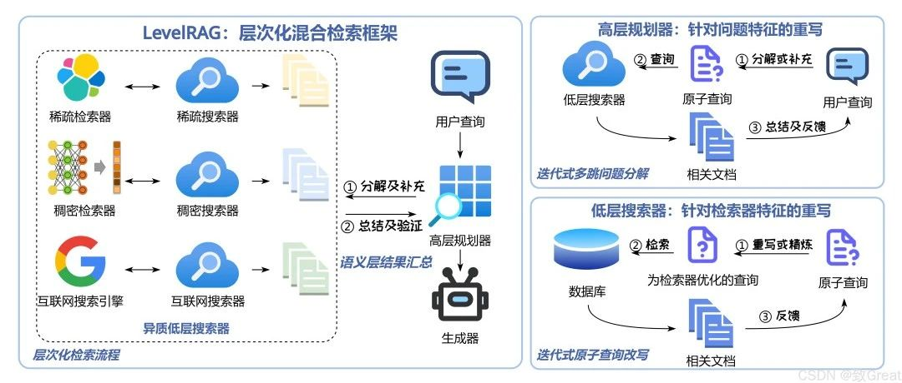
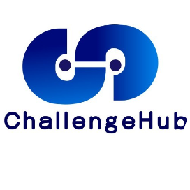

# LevelRAG：突破查询重写瓶颈，提升混合检索效果

原文链接: https://mp.weixin.qq.com/s/qCWQyu4vQxwHbmkNOLTlpQ

> 论文题目：《LevelRAG: Enhancing Retrieval-Augmented Generation with Multi-hop Logic Planning over Rewriting Augmented Searchers》

> 论文链接：https://arxiv.org/pdf/2502.18139v1

> 论文代码：https://github.com/ictnlp/LevelRAG

### **📌 论文核心问题**

这篇论文主要关注 **检索增强型生成（Retrieval-Augmented Generation, RAG）** 在 **混合检索** 场景中的挑战，特别是 **查询重写（query rewriting）** 与 **密集检索器（dense retriever）** 之间的紧密耦合带来的问题。

🤔 **主要问题包括：**

* **查询重写的适用性** 📌 现有的查询重写技术大多只适用于密集检索器，导致在混合检索（结合稀疏检索、密集检索、网络搜索）中效果受限。
* **检索结果的完整性 & 准确性** 📌 混合检索可能会带来重复或矛盾的信息，影响最终答案质量。
* **稀疏检索器的优化问题** 📌 现有查询重写方法未能充分发挥稀疏检索器的优势，如何提高其检索精度仍是个难题。
### **🔎 相关研究**

🔍 **查询重写（Query Rewriting）**

* 训练查询重写模型（Ma et al. 2023, Mao et al. 2024）
* 通过 LLM 生成伪上下文提升检索效果（Gao et al. 2022, Wang et al. 2023）
* 迭代优化查询，利用检索到的上下文进行反馈（Feng et al. 2023, Trivedi et al. 2023）
* **查询分解**：将复杂查询拆解成多个子问题（Chan et al. 2024）

🔍 **混合检索（Hybrid Retrieval）**

* 结合 **BM25** 和 **密集检索** 提高检索效果（Lu et al. 2022, Wang et al. 2023）
* 利用 **LLM 进行信息路由**（Wang et al. 2024）
* **网络搜索引擎 + 密集检索器** 结合增强检索能力（Yan et al. 2024）
* **多检索器集成（EoR）** 提高检索协作效率（Li et al. 2024）

🔍 **并行研究（Concurrent Work）**

* **MindSearch (Chen et al. 2024)** 采用 **WebPlanner + WebSearcher** 两级检索架构，虽然架构类似，但方法和贡献不同。

---

### **💡 LevelRAG 方法详解**

为了破解上述挑战，论文提出了 **LevelRAG**，它主要由 **高级检索器（High-Level Searcher）** 和 **低级检索器（Low-Level Searchers）** 组成。

#### **🔹 1. 高级检索器：多跳逻辑规划**

**核心思想：** 先规划查询，再进行检索，以确保信息完整。

🔍 **操作步骤：**

* **分解（Decompose）**：把复杂查询拆分成多个原子查询。
* **总结（Summarize）**：提炼检索到的文档，得到直接答案。
* **验证（Verify）**：检查当前信息是否足够回答问题。
* **补充（Supplement）**：如果不够，再补充新的原子查询。
#### **🔹 2. 低级检索器：三种检索器协作**

**1️⃣ 稀疏检索器（Sparse Searcher）**

* 基于 **Lucene 语法**，专注于关键词匹配。
* 采用 **扩展（Extend）、强调（Emphasize）、过滤（Filter）** 方法提升查询质量。

**2️⃣ 密集检索器（Dense Searcher）**

* 适用于 **模糊查询 & 语义检索**。
* 通过 **伪文档** 增强语义信息。

**3️⃣ 网络搜索引擎（Web Searcher）**

* 用于补充本地数据库缺失的信息。

---

### **🏆 实验 & 结果**

论文在 **五个数据集**（PopQA、Natural Questions、TriviaQA、HotpotQA、2WikimultihopQA）上进行了实验，并与多个基线方法对比。

📌 **实验重点：**

* **检索成功率** & **响应准确性（F1 分数）**
* 对比 **无检索（GPT4o、Qwen 2）** 和 **有检索（ITRG、SelfRAG、ReSP、RankRAG）** 方法

📊 **关键发现：**

* **LevelRAG 在所有数据集上的表现均优于或接近最佳方法**
* **在复杂多跳问答任务中（2WikimultihopQA），比现有最佳方法高 22.13 个百分点！**
* **稀疏检索器的优化提升了 14.8% 的检索成功率**

📌 **消融实验：**

* 高级检索器的 **分解 & 补充** 操作是提升检索成功率的关键。
* 稀疏检索器的 **查询重写 & 反馈机制** 显著提高了检索质量。

📌 **与基于代理的方法对比：**

* 在 **HotpotQA** 数据集上，LevelRAG 的 F1 分数 **优于 ReACT 和 FireACT**。

📌 **完整性验证：**

* LevelRAG **优于单一检索器 & 传统混合检索**，确保了 **检索完整性 & 准确性**。

---

### **🚀 未来研究方向**

尽管 LevelRAG 取得了显著的成果，但仍有一些值得进一步探索的方向：

🔍 **1. 检索器的优化**

* **稀疏检索器**：探索更先进的 **查询语言** 进一步提升精准度。
* **密集检索器**：结合 **多模态表示（文本 + 图像）** 增强语义理解。
* **网络搜索引擎**：如何更智能地融合搜索结果？

🔍 **2. 更智能的多跳逻辑规划**

* **强化学习** 让规划更加动态适应不同查询场景。
* **上下文感知** 让查询规划更智能。

🔍 **3. 检索必要性判断 & 动态选择检索器**

* 不是所有查询都需要检索！
* **能否智能判断是否需要检索，还是直接生成答案？**
* **自动选择最优的检索器组合，提高效率**。

🔍 **4. 进一步扩展实验**

* **在更多领域 & 语言测试泛化能力**
* **处理大规模数据集，发现潜在瓶颈**

🔍 **5. 更好的用户交互 & 反馈机制**

* **交互式检索系统，让用户参与优化检索结果**
* **根据用户反馈动态调整检索策略**

🔍 **6. 提高计算效率 & 资源优化**

* **如何让 LevelRAG 更高效运行，减少计算资源消耗？**
* **模型压缩、并行计算、缓存机制等优化手段**

---

### **🎯 总结**

📌 **LevelRAG 通过**：

* 高级检索器的 **逻辑规划**
* 低级检索器的 **多检索融合**
* 稀疏检索器的 **查询优化**

**优化了 RAG 在混合检索场景中的查询重写和检索逻辑，提高了检索完整性和准确性。**

📌 **实验结果表明**：LevelRAG **在复杂问答任务中表现出色**，特别是在 **多跳推理任务** 中，显著优于现有方法。

🚀 未来，LevelRAG 可以进一步优化检索策略，提高适应性，并提升计算效率！

  

添加微信，回复”RAG“进入交流群

  

预览时标签不可点

素材来源官方媒体/网络新闻

微信扫一扫  
关注该公众号

继续滑动看下一个

轻触阅读原文

ChallengeHub 

向上滑动看下一个

[知道了](javascript:;)

微信扫一扫  
使用小程序

[取消](javascript:void(0);)
[允许](javascript:void(0);)

[取消](javascript:void(0);)
[允许](javascript:void(0);)

×
分析

微信扫一扫可打开此内容，  
使用完整服务

：
，
，
，
，
，
，
，
，
，
，
，
，
。
 
视频
小程序
赞
，轻点两下取消赞
在看
，轻点两下取消在看
分享
留言
收藏
听过
