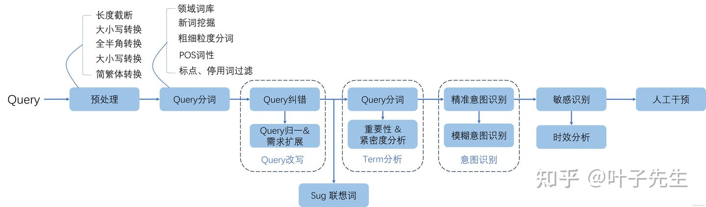
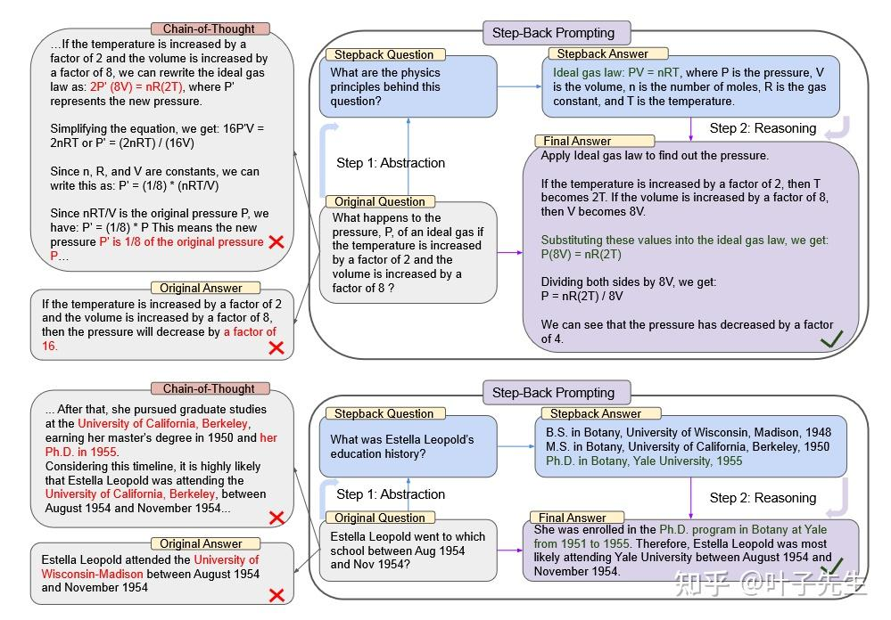
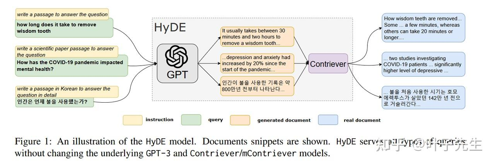
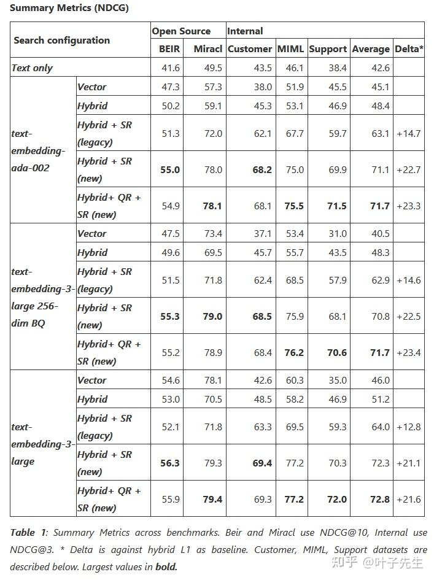
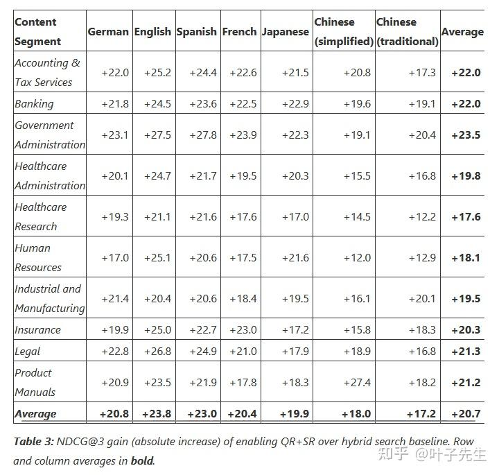

# Query Rewriting查询改写方案汇总 - 知乎

原文链接: https://zhuanlan.zhihu.com/p/26631768854

## 1.背景

在目前主流的语义查询中，query的质量直接影响搜索召回的关联结果。

由于用户的查询输入对于服务者来说是不可控的，而不同的query质量直接影响不同的召回结果。一般查询语句中会出现各种各样的意图问题，比如不明确、混淆、错误之类的，查询重写旨在通过一系列手段修正query的错误，提高query的质量，以尽可能准确的识别用户的查询意图，匹配到关键的召回结果。

针对Query进行处理其实是一个在搜索系统中比较常见和有历史的工程手段了，它们一般基于固定的规则和流程实现。

  

整个Query处理的流程

Query Rewriting是对Query进行处理的一种方式，实际上对query进行的操作，或者关联query的大部分操作都可以归类于Qeury Rewriting这类里。

以下将把短查询和长查询的处理分开介绍，原因是短查询本身往往没有那么多语义信息，而且意图并不准确，实际上处理方式都是数据增强，对query进行不同程度的扩写，相当于补充上下文，而不同的短查询有各自的特征，这些特征决定了数据增强的方案。而长查询往往能够有一个相对精确的语义和意图，只是可能仍然存在语义信息不足的问题，需要对原文进行补充的同时不破坏原先的语义。

简单来说，针对短查询和长查询的处理思路核心分别是“揣测”和“解释”，短查询由于没有明确上下文和语义信息，需要去猜测最可能的意图，长查询有一定的上下文和相对精准的语义信息，只需要扩充和补充说明或者纠正。

## 2.短查询数据增强

### 2.1.意图多样

意图多样是指短查询提供的词或短语可能存在多种不同的意图，这个query在不同的语境中有不同的含义和不同的关联，或者可以指代语义跨度大的物或事件。

例如，query输入为“周杰伦”时，可能的表示是“周杰伦 歌曲”，“周杰伦 mv”，“周杰伦演唱会”，“周杰伦 新闻”等等，甚至在搜索集中存在重名的人或物或者同名不同意的名词时，都会出现。

这里的解决方法实际是针对单个名词进行分类，以扩写对应种类的query，比如上例的“周杰伦”，可能指代的一系列表述。

### 2.2.意图不清

意图不清是指短查询提供的词或短语存在意图，但表述不够清晰或错误而导致完全错误的结果或无关的结果。

例如，用户输入为“xpox”，实际可能指的是“xbox”游戏机，输入“SL2”可能指的是“SK2”这款化妆品。

这里需要对输入按词为单元进行分词和纠错，纠正可能存在的错误输入来还原真实意图。

### 2.3.隐含信息

隐含信息是指短查询中提供的意图准确，但缺少必要上下文，需要结合一些额外信息进行推断和扩充。

例如，用户输入为“天气预报”，实际可能是说当地的“天气预报”，所以可能是“上海 天气预报”，通过请求IP来进行判断和扩充，类似的还有“上衣”，实际可能根据用户性别，真实意图为“女 上衣”。

需要结合外部的信息来对输入进行处理扩充。

### 2.4.相关性扩充

相关性扩充是指给短查询根据相关性添加意图，往往是说输入有精确的上下文，比如某件事或者某物，但缺少对应的意图。

例如，输入为“肚子痛”，实际可能是“肚子痛怎么办”，输入“糖醋里脊”，实际可能是“糖醋里脊 菜谱”。

这一点有点类似上面的意图多样，但实际上还是有区别，因为这里的上下文不存在二义性，一般就是代指一个固定的概念或者事物，然后又有着直接相关的意图，因此直接进行补充。

## 3.长查询重写

### 3.1.样本重写

样本重写的思路其实都是一致的，就是通过有/无参考让LLM通过prompt进行query的改写。

### 3.1.1.零样本重写

零样本重写（Zero-shot query rewriting）实际就是简单的查询重写，通过prompt要求LLM进行重写，不提供任何用于参考的问答对或其他数据。

参考prompt：

> Rewrite the provided user query into three alternative versions while preserving the original intent and meaning. Each rewritten query should be clear, contextually relevant, and provide expanded details or rephrased expressions to enhance variety and potential answer retrieval quality. Ensure that none of the rewrites alter the core semantic content or introduce unrelated information. The rewritten queries should be distinct from one another, reflecting different phrasing, structure, or additional clarifying elements.  
> **Instructions for Output Formatting:**  
>   
> Provide the three rewritten queries in a numbered list.  
> Ensure that each query version maintains a natural, fluent tone.  
> Avoid redundancy or overly similar structures between the three versions.  
> Example input query: *"How does photosynthesis work in plants?"*  
> Example output:  
>   
> What is the process by which plants perform photosynthesis, and how does it function?  
> Can you explain how photosynthesis operates in plants, including its main stages?  
> How do plants convert light energy into chemical energy through photosynthesis?

### 3.1.2.小样本重写

小样本重写（Few-shot query rewriting）是指提供小部分的样本数据（问答对、参考信息）组装在prompt内，要求LLM对其进行重写。

小样本重写中可以根据实际场景或者格式要求构造对应的问答对，一般LLM会模仿提供问答对中重写的风格，更关注输入query的某些部分，同时舍去不必要的部分。

参考prompt：

> You will be provided with three pairs of questions and their corresponding rewritten versions. Your task is to expand and rephrase the given queries while preserving the original intent and meaning. The goal is to generate three alternative versions of each query that do not distort the original meaning, but offer varied phrasing, additional clarifying information, or more comprehensive wording. The rewritten queries should reflect the same core question, ensuring they remain contextually relevant and understandable.  
> Instructions:  
>   
> For each given pair, read both the original query and the rewritten query.  
> Generate three new versions of the original query, following the same pattern as the provided rewrites. Each new query should:  
>   
> Be expanded in some way (adding details, rephrasing, or providing clarifying context).  
> Maintain the same semantic meaning without introducing any new information that would change the intent.  
>   
> Present the three rewritten versions of the original query in a numbered list.  
> Ensure that your rewrites have clear, natural phrasing and are distinct from each other.  
> Example Input :  
>   
> Original Query: {original\_query\_1} Rewritten Query: {rewritten\_query\_1}  
> Original Query: {original\_query\_2} Rewritten Query: {rewritten\_query\_2}  
> Original Query: {original\_query\_3} Rewritten Query: {rewritten\_query\_3}  
> Task: For each of the original queries, rewrite them in three different ways, following the style of the provided rewritten examples. Be sure to keep the meaning intact while providing expanded and varied phrasing.

### 3.1.3.预训练重写器

预训练重写器（Trainable rewriter）实际上是通过训练一个重写的预训练模型来完成重写这一项任务，个人理解实际上对应的就是超多样本的重写，只是一般不会把超多样本塞到prompt里提供给LLM，所以选择了通过预训练做知识内化这个过程。

关于这类query重写的预训练模型，实际上还可以通过强化学习来优化它在领域内的表现。

实现上可以参考：[https://github.com/xbmxb/RAG-query-rewriting/tree/main](https://link.zhihu.com/?target=https%3A//github.com/xbmxb/RAG-query-rewriting/tree/main)

### 3.2.子查询拆分

子查询拆分（Sub query split）是指通过大模型将请求的原始Query进行拆分，使其变为多个子的小问题，一般是针对复杂查询会选择的一种方法。

举个例子，当query为

“什么是世界上在机器学习领域最好的编程语言以及为什么它这么受欢迎？”

时，会要求LLM进行拆分后的结果可能是：

* “什么是世界上在机器学习领域最好的编程语言？”
* “世界上在机器学习领域最好的编程语言为什么受欢迎？”

它更多的是把查询中真正的问题拆分开了，并且将前后提问的主语或者被代词替代的关键信息进行同步，实际上这里的提问就是两个问题。

实现的方式其实也是通过请求大模型通过prompt来要求大模型在不改变语义的情况下进行拆分，不再举例了。

### 3.3.后退提示词

后退提示词（Step back prompt）是指大模型对复杂问题进行处理时，选择“后退”一步进行思考，将问题抽象出基本规则后再进行回答的过程。

论文：[arXiv reCAPTCHA](https://link.zhihu.com/?target=https%3A//arxiv.org/abs/2310.06117)

原始问题为“如果温度增加2倍而体积增加8倍，那么理想气体的压力 P 会发生什么变化？”

实际是一个物理问题，这里要求LLM对原始问题进行抽象，获得与它相关的更广义的问题，这里设计的prompt是“这个物理问题背后关联的物理规则是什么？”，然后得到了相关的计算公式和规则描述，再提供给大模型结合原始问题进行问答，得到最终答案。

两个步骤：

1. Abstraction，对原始问题进行抽象，生成关联的更广义的问题
2. Reasoning，使用步骤1生成的问题获取stepback answer，最后结合原始问题一起用于LLM生成最终回答

个人认为比较关键的其实是如何构造有效的Stepback Question，因为实际上面对不同类型的问题，这个后退问题应该是不一样的，所以如何构造有效的后退问题本身就是个问题，使用大模型的话整个请求链又显得太长了，相当于请求三次（1.构造后退问题，2.获得后退问题答案，3.真实请求），这样看其实这个方法在RAG流程里不是很适用，更倾向于纯粹的prompt engine

### 3.4.假设文档嵌入

假设文档嵌入（HyDE）是一种零样本的密集检索方法，它通过根据查询生成的假设文档来桥接原始查询和结果的关系。

论文：[arXiv reCAPTCHA](https://link.zhihu.com/?target=https%3A//arxiv.org/abs/2212.10496)

用户输入原始查询后，通过LLM生成一个跟问题语义相近的假设文档，之后再通过embedding模型将假设文档转化为向量，之后在语料库中按照向量相似度搜索相关的文档。

实际上后半段流程就是语义搜索的过程，相当于把原始输入通过大模型进行扩充了，这样能添加更丰富的信息或者更接近真实查询意图的内容。

步骤：

1. 根据原始输入的查询，使用LLM生成一个假设文档
2. 将假设文档嵌入为向量
3. 使用假设文档的嵌入向量作为召回依据，进行召回

## 4.实际工程层面的思考

### 4.1.时间顾虑

长查询重写一般都是基于LLM的，依靠LLM的语言能力重新生成一段query，但这样还是很耗时的，特别是类似后退提示词这种手段，虽然效果可能很好，但实际落地到工程几乎是不可能的，重写一个query要请求2-3次LLM，实在是得不偿失。

所以一般比较契合真实落地场景的，要么是专门针对搜索场景的（例如HyDE），要么就是自己来做预训练重写器的。前者是设计上的胜利，后者是资源和投入上的胜利。

### 4.2.实际提升

可以参考微软这篇文章的测试结果，虽然没有公开实施过程中的QueryRewriting的SLM模型（与本文3.1.3一致的方法，应该是一个预训练重写器，专门做了低延迟优化），但还是可以参考下结论数据。

[Raising the bar for RAG excellence: introducing generative query rewriting and new ranking model](https://link.zhihu.com/?target=https%3A//techcommunity.microsoft.com/blog/azure-ai-services-blog/raising-the-bar-for-rag-excellence-query-rewriting-and-new-semantic-ranker/4302729/)

这张表主要是在不同基座的embedding模型下，叠加使用SR（search rerank）或QR（query rewriting）的效果提升，可以看到实际上加入sr的提升比较大，qr的提升比较小。

这张表比较的是针对传统的Hybrid搜索，开启SR+QR在不同类型数据上的有效提升，可以看到中文一直是比较低的，具体的原因原文没有谈，推测一部分是模型的原因，一部分是中文本身语言多义的原因。

