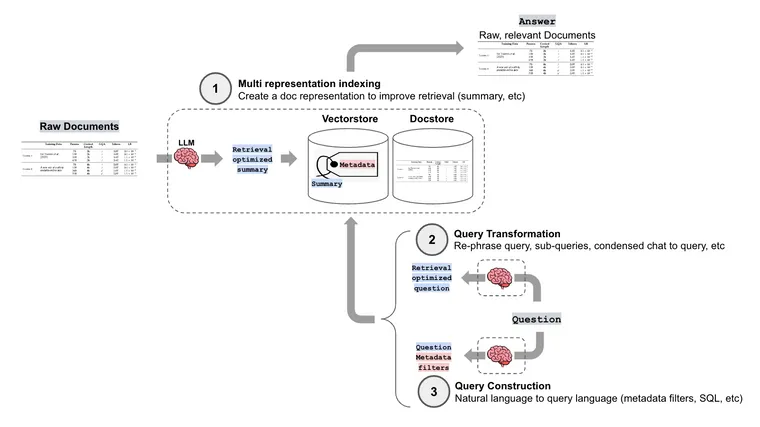
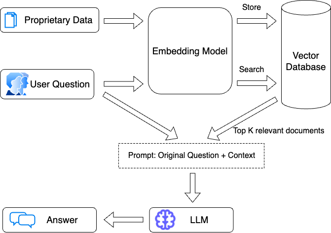
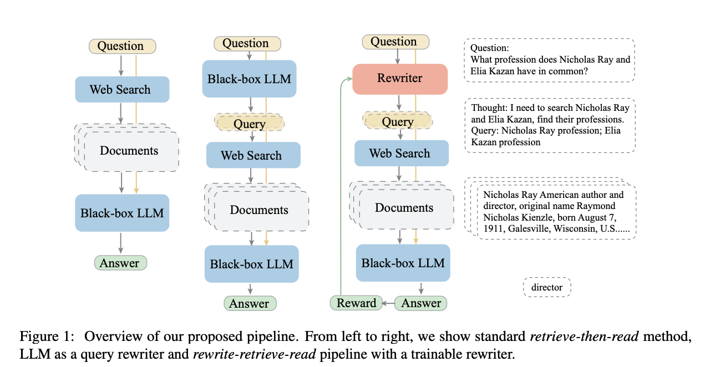
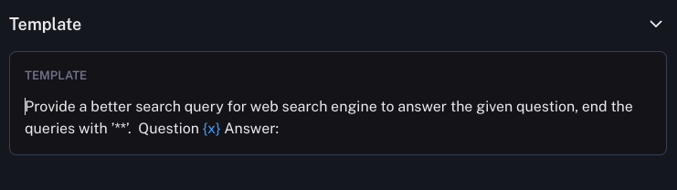
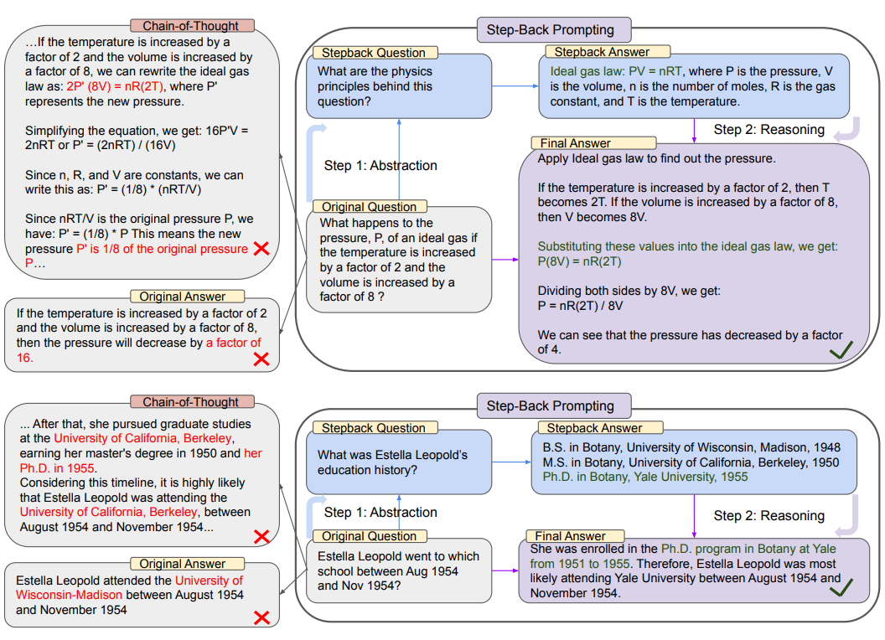
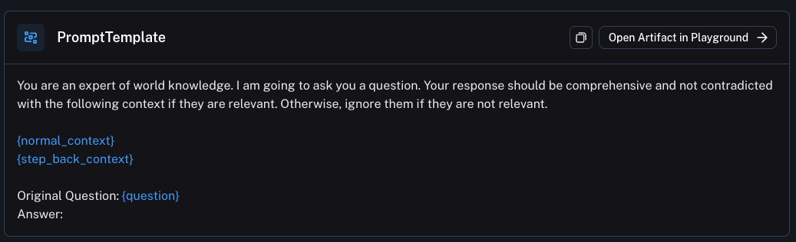
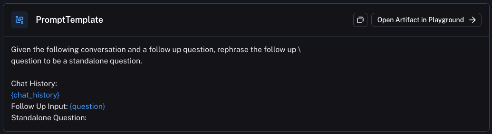

# Query Transformations

# Query Transformations

4 min read
Oct 24, 2023

Naive RAG typically splits documents into chunks, embeds them, and retrieves chunks with high semantic similarity to a user question. But, this present a few problems: (1) document chunks may contain irrelevant content that degrades retrieval, (2) user questions may be poorly worded for retrieval, and (3) structured queries may need to be generated from the user question (e.g., for querying a vectorstore with metadata filtering or a SQL db).

LangChain has many [advanced retrieval methods](https://python.langchain.com/docs/modules/data_connection/retrievers/?ref=blog.langchain.dev) to help address these challenges. (1) **Multi representation indexing**: Create a document representation (like a summary) that is well-suited for retrieval (read about this using the Multi Vector Retriever in [a blog post](https://blog.langchain.dev/semi-structured-multi-modal-rag/) from last week). (2) **Query transformation**: in this post, we'll review a few approaches to transform humans questions in order to improve retrieval. (3) **Query construction**: convert human question into a particular query syntax or language, which will be covered in a future post.

If you think of a naive RAG pipeline, the general flow is that you take the users question and pass that directly to an embedding model. That embedding is then compared to documents stored in the vectorstore, and the top `k` most similar ones are returned.

Query transformation deals with transformations of the user's question before passing to the embedding model.

💡Although this is not a new phenomenon ([query expansion](https://www.searchenginejournal.com/what-is-google-query-expansion-cases-and-examples/7924/?ref=blog.langchain.dev) has been used in search for years) what is new is the ability to use LLMs to do it.

Below are a few variations of papers and retrieval methods that take advantage of this. They are all using an LLM to generate a new (or multiple new) queries, and the main difference is the prompt they use to do that generation.

## Rewrite-Retrieve-Read

This paper uses an LLM to **rewrite** a user query, rather than using the raw user query to retrieve directly.

> Because the original query can not be always optimal to retrieve for the LLM, especially in the real world... we first prompt an LLM to rewrite the queries, then conduct retrieval-augmented reading.

The prompt used is a relatively simple one (on the Hub [here](smith.langchain.com/hub/langchain-ai/rewrite)):

Links:

* [Paper](https://arxiv.org/pdf/2305.14283.pdf?ref=blog.langchain.dev)
* [LangChain Implementation](https://github.com/langchain-ai/langchain/blob/master/cookbook/rewrite.ipynb?ref=blog.langchain.dev)

## Step back prompting

This paper uses an LLM to generate a "step back" question. This can be use with or without retrieval. With retrieval, both the "step back" question and the original question are used to do retrieval, and then both results are used to ground the language model response.

[Here](https://smith.langchain.com/hub/langchain-ai/stepback-answer?ref=blog.langchain.dev) is the prompt used:

Links:

* [Paper](https://arxiv.org/pdf/2310.06117.pdf?ref=blog.langchain.dev)
* [LangChain Implementation](https://github.com/langchain-ai/langchain/blob/master/cookbook/stepback-qa.ipynb?ref=blog.langchain.dev)

## Follow Up Questions

The most basic and central place query transformation is used is in conversational chains to handle follow up questions. When dealing with follow up questions, there are essentially three options:

1. Just embed the follow up question. This means that if the follow up question builds on, or references the previous conversation, it will lose that question. For example, if I first ask "what can I do in Italy" and then ask "what type of food is there" - if I just embed "what type of food is there" I will have no context of where "there" is.
2. Embed the whole conversation (or last `k` messages). The problem with this is that if a follow up question is completely unrelated to previous conversation, then it may return completely irrelevant results that would distract during generation.
3. Use an LLM to do a query transformation!

In this last option, you pass the whole conversation to date (including the follow up question) to the LLM and ask it generate a search term. This is what we do in [WebLangChain](https://blog.langchain.dev/weblangchain/) and what most chat based retrieval applications likely do.

The question then becomes: what prompt do I use to transform the whole conversation into a search query? This is where a lot of prompt engineering needs to be done. Below is the prompt we use for WebLangChain (it phrases the "query generation" bit as constructing a standalone question). See it on the Hub [here](https://smith.langchain.com/hub/langchain-ai/weblangchain-search-query?ref=blog.langchain.dev).

## Multi Query Retrieval

In this strategy, an LLM is used to generate multiple search queries. These search queries can then be executed in parallel, and the retrieved results passed in altogether. This is really useful when a single question may rely on multiple sub questions.

For example consider the following question:

> Who won a championship more recently, the Red Sox or the Patriots?

This really requires two sub-questions:

* "When was the last time the Red Sox won a championship?"
* "When was the last time the Patriots won a championship?"

Links:

* [LangChain Implementation](https://python.langchain.com/docs/modules/data_connection/retrievers/MultiQueryRetriever?ref=blog.langchain.dev)

## RAG-Fusion

A recent article builds off the idea of Multi-Query Retrieval. However, rather than passing in all the documents, they use reciprocal rank fusion to reorder the documents.

Links:

* [Blog Post](https://towardsdatascience.com/forget-rag-the-future-is-rag-fusion-1147298d8ad1?ref=blog.langchain.dev)
* [LangChain Implementation](https://github.com/langchain-ai/langchain/blob/master/cookbook/rag_fusion.ipynb?ref=blog.langchain.dev)

## Conclusion

As you can see, there are many different ways to do query transformation. Again, this is not a new topic - but what is new is using LLMs to do this. The differences in the methods comes down to the prompts used. It's very easy to write prompts - almost as easy as it to think of them. Which begs the question - what query transformations are YOU going to come up with? Let us know!

### Join our newsletter

Updates from the LangChain team and community

Enter your email

Subscribe

Processing your application...

Success! Please check your inbox and click the link to confirm your subscription.

Sorry, something went wrong. Please try again.

