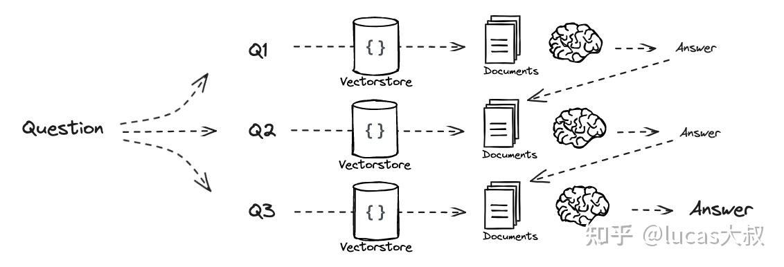
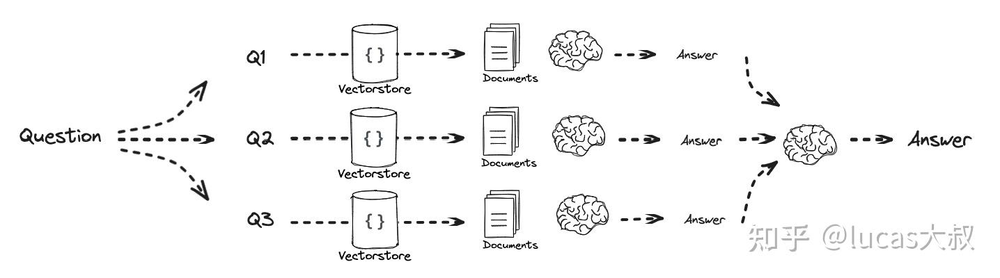
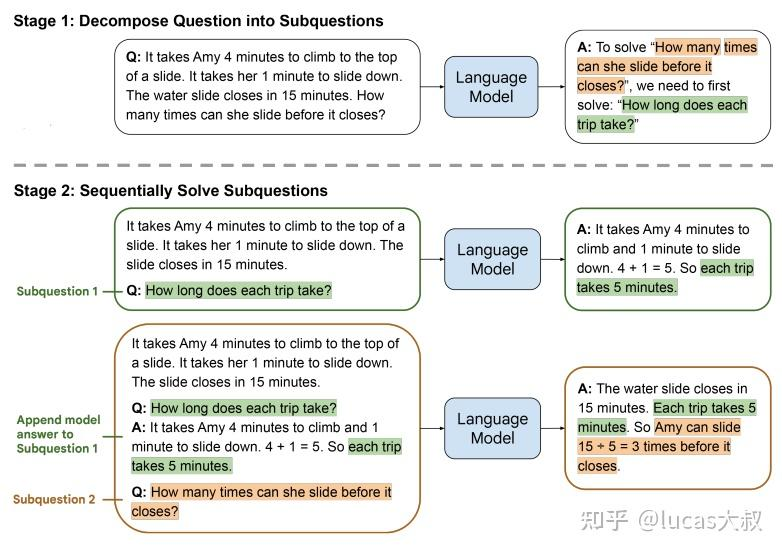
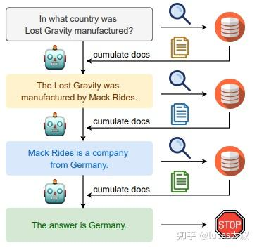

# 从0开始学RAG之Query分解 - 知乎

原文链接: https://zhuanlan.zhihu.com/p/685746861


Query分解是通过将问题分解为子问题来改善问答效果的策略，分两条实现路径：（1）序列求解，将上一个子问题的答案与当前问题一并扔给LLM生成答案，再把当前生成答案与下一个子问题一起给LLM生成答案，直到最后一个子问题生成最终答案；（2）并行的独立回答问题，然后将多路答案合并为最终答案。

下面的示意图很好地诠释了两种技术实现路径的原理。



序列求解



独立求解

序列求解的思想来自[least-to-most prompting](https://link.zhihu.com/?target=https%3A//arxiv.org/pdf/2205.10625.pdf)和[IRCoT](https://link.zhihu.com/?target=https%3A//arxiv.org/pdf/2212.10509.pdf)这两篇论文。

在[least-to-most prompting](https://link.zhihu.com/?target=https%3A//arxiv.org/pdf/2205.10625.pdf)中，作者认为CoT提示在自然语言推理任务上表现抢眼，但在解决比给的样例更难的问题时就乏善可陈了。为了解决easy-to-hard泛化问题，大佬们提出了least-to-most prompting。分两步解决问题：首先将复杂问题分解成一系列更容易的子问题，然后依次求解这些子问题，用先前解决的子问题答案助力当前子问题的解决。这两步都是通过few-shot prompting来实现，不需要训练或者微调。



在[IRCoT](https://link.zhihu.com/?target=https%3A//arxiv.org/pdf/2212.10509.pdf)中作者提出了类似的想法，对多步问答在CoT中交错检索，使用检索到的结果改善CoT。



更多技术细节，大家可以参考上述的两篇论文。下面我们转入代码实战环节。

---

首先写提示模板，将问题分解为若干个子问题。

```
from langchain.prompts import ChatPromptTemplate

# Decomposition
template = """You are a helpful assistant that generates multiple sub-questions related to an input question. \n
The goal is to break down the input into a set of sub-problems / sub-questions that can be answers in isolation. \n
Generate multiple search queries related to: {question} \n
Output (3 queries):"""
prompt_decomposition = ChatPromptTemplate.from_template(template)
```

构造分解问题的chain，并将问题分解为几个子问题。

```
from langchain_openai import ChatOpenAI
from langchain_core.output_parsers import StrOutputParser

# LLM
llm = ChatOpenAI(temperature=0)

# Chain
generate_queries_decomposition = ( prompt_decomposition | llm | StrOutputParser() | (lambda x: x.split("\n")))

# Run
question = "What are the main components of an LLM-powered autonomous agent system?"
questions = generate_queries_decomposition.invoke({"question":question})
```
### Answer recursively

如上面序列求解流程所示，构建序列回答的prompt模板，基于context和qa对回答问题。

```
# Prompt
template = """Here is the question you need to answer:

\n --- \n {question} \n --- \n

Here is any available background question + answer pairs:

\n --- \n {q_a_pairs} \n --- \n

Here is additional context relevant to the question: 

\n --- \n {context} \n --- \n

Use the above context and any background question + answer pairs to answer the question: \n {question}
"""

decomposition_prompt = ChatPromptTemplate.from_template(template)
```

初始化q\_a\_pairs为空，查询第一个问题时，没有qa对信息。从第二个问题开始，除了当前的问题，还有前面所有轮的qa对信息，再加上当前问题检索回来的context一起给LLM得到答案。

```
from operator import itemgetter
from langchain_core.output_parsers import StrOutputParser

def format_qa_pair(question, answer):
    """Format Q and A pair"""
    
    formatted_string = ""
    formatted_string += f"Question: {question}\nAnswer: {answer}\n\n"
    return formatted_string.strip()

# llm
llm = ChatOpenAI(model_name="gpt-3.5-turbo", temperature=0)

# 
q_a_pairs = ""
for q in questions:
    
    rag_chain = (
    {"context": itemgetter("question") | retriever, 
     "question": itemgetter("question"),
     "q_a_pairs": itemgetter("q_a_pairs")} 
    | decomposition_prompt
    | llm
    | StrOutputParser())

    answer = rag_chain.invoke({"question":q,"q_a_pairs":q_a_pairs})
    q_a_pair = format_qa_pair(q,answer)
    q_a_pairs = q_a_pairs + "\n---\n"+  q_a_pair
```
### Answer individually

相比于序列回答，并行独立回答逻辑简单的多。每个子问题各自调用LLM回答自己的提问，汇总得到的答案。

```
# Answer each sub-question individually 

from langchain import hub
from langchain_core.prompts import ChatPromptTemplate
from langchain_core.runnables import RunnablePassthrough, RunnableLambda
from langchain_core.output_parsers import StrOutputParser
from langchain_openai import ChatOpenAI

# RAG prompt
prompt_rag = hub.pull("rlm/rag-prompt")

def retrieve_and_rag(question,prompt_rag,sub_question_generator_chain):
    """RAG on each sub-question"""
    
    # Use our decomposition / 
    sub_questions = sub_question_generator_chain.invoke({"question":question})
    
    # Initialize a list to hold RAG chain results
    rag_results = []
    
    for sub_question in sub_questions:
        
        # Retrieve documents for each sub-question
        retrieved_docs = retriever.get_relevant_documents(sub_question)
        
        # Use retrieved documents and sub-question in RAG chain
        answer = (prompt_rag | llm | StrOutputParser()).invoke({"context": retrieved_docs, 
                                                                "question": sub_question})
        rag_results.append(answer)
    
    return rag_results,sub_questions

# Wrap the retrieval and RAG process in a RunnableLambda for integration into a chain
answers, questions = retrieve_and_rag(question, prompt_rag, generate_queries_decomposition)
```

提示模板的指令也简单粗暴，告诉模型这是一组QA对，你用它们来合成原始问题的答案吧！

```
def format_qa_pairs(questions, answers):
    """Format Q and A pairs"""
    
    formatted_string = ""
    for i, (question, answer) in enumerate(zip(questions, answers), start=1):
        formatted_string += f"Question {i}: {question}\nAnswer {i}: {answer}\n\n"
    return formatted_string.strip()

context = format_qa_pairs(questions, answers)

# Prompt
template = """Here is a set of Q+A pairs:

{context}

Use these to synthesize an answer to the question: {question}
"""

prompt = ChatPromptTemplate.from_template(template)

final_rag_chain = (
    prompt
    | llm
    | StrOutputParser()
)

final_rag_chain.invoke({"context":context,"question":question})
```
