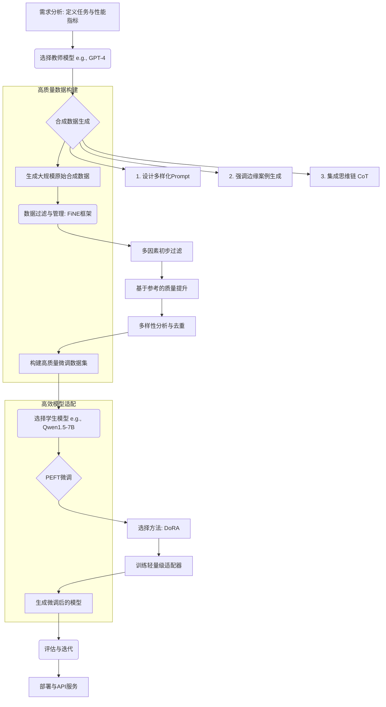

# 综合技术研究报告：提升小型语言模型可靠性与微调效率的前沿实践


## 执行摘要

本技术研究报告深入探讨了在小型语言模型（3B-7B参数范围）应用中两个关键挑战的根本原因及前沿解决方案：模型幻觉与上下文追踪失败，以及微调过程中的效率与成本问题。报告的核心发现指出，模型幻觉主要源于模型对训练数据分布之外信息的错误推断和对上下文指令的误读，而上下文追踪失败则归因于不当的对话历史数据结构。为应对这些挑战，业界已发展出成熟的解决方案。**在提升模型可靠性方面**，采用XML标签、JSON格式等结构化提示工程技术，能够显著增强指令的清晰度，将任务指令与示例严格分离，从而有效降低幻觉产生率。同时，精心的少样本（Few-Shot）示例设计，特别是在样本相关性、数量（通常对小模型而言，超过10个样本可能导致性能下降）和顺序上的优化，对引导模型生成准确内容至关重要。对于多轮对话场景，“聊天模板”（Chat Templates）的应用，如Llama 2、Mistral和Qwen等模型的特定格式，是确保模型能够正确理解并利用其自身先前响应的关键。

**在优化微调效率方面**，模型蒸馏和参数高效微调（PEFT）技术成为核心策略。通过使用如GPT-4等强大的“教师模型”生成高质量的合成数据（模型蒸馏），可以为“学生模型”提供大规模、多样化且包含复杂推理链（Chain-of-Thought）的训练材料。结合如FiNE等先进的数据过滤与管理框架，能够确保合成数据的质量，为微调打下坚实基础。参数高效微调（PEFT）方法，尤其是如LoRA、QLoRA及其改进版DoRA，通过仅更新模型参数的一小部分，极大地降低了微调的计算与存储成本，同时有效缓解了“灾难性遗忘”问题，并为多任务适配提供了高度模块化的解决方案。本报告最后提出了一套集成的最佳实践工作流程，并提供了具体的实施建议与API设计规范，旨在为开发和部署更可靠、更高效的小型语言模型提供全面的技术指引。

## 引言

近年来，小型语言模型（SLMs）因其在计算资源消耗、部署灵活性和推理延迟方面的显著优势，正迅速成为人工智能应用领域的研究热点和产业部署的首选。然而，这些模型在实现与大型语言模型（LLMs）相媲美的性能时，面临着两大核心技术瓶颈。

第一个瓶颈是**可靠性问题**，主要表现为“模型幻觉”（Hallucination）和在多轮对话中的“上下文追踪失败”。模型幻觉，即模型生成看似合理但实际上与事实不符或毫无根据的内容，严重削弱了其在知识密集型任务中的可信度。上下文追踪失败则表现为模型在连续的多轮对话中无法记忆或正确利用其自身先前生成的响应，导致对话缺乏连贯性，这一问题在构建高级对话式AI系统中尤为突出。

第二个瓶瓶颈是**微调（Fine-Tuning）的效率与成本问题**。为了使预训练的SLMs适应特定的下游任务（如特定的查询重写逻辑或遵循特定指令），微调是必不可少的步骤。然而，传统的全参数微调即便对于小型模型而言，也需要消耗大量的计算资源和时间，并且往往需要海量高质量的标注数据，而这类数据的获取成本高昂且周期漫长。

本报告旨在深入剖析上述两个核心问题的根本原因，并系统性地梳理和评估当前业界为解决这些问题所采用的主流技术方案、具体的实施策略和最佳实践。报告将分为三个主要部分：第一部分专注于提升模型可靠性，深入分析幻觉的成因，并探讨通过高级提示工程和优化的数据结构来增强模型指令遵循能力与上下文理解能力的方法。第二部分聚焦于微调的效率与优化，详细介绍利用模型蒸馏生成高质量合成数据以及应用参数高效微调（PEFT）技术来降低训练成本、规避灾难性遗忘的核心机制。第三部分则提出了一套集成的实施策略、具体的开发建议以及标准的API接口设计，旨在为构建高性能、高可靠性且经济高效的小型语言模型应用提供一套全面且可操作的技术指南。

## 第一部分：增强可靠性与缓解幻觉

小型语言模型的可靠性是其能否在实际应用中大规模部署的关键前提。本部分将深入分析导致模型产生幻觉和上下文追踪失败的根本原因，并详细阐述当前业界用于解决这些问题的最前沿、最有效的技术方案，重点涵盖高级提示工程、少样本示例设计以及针对多轮对话的专用数据结构。

### 3. 模型幻觉与上下文追踪失败的根本原因分析

#### 3.1 模型幻觉的成因

模型幻觉并非随机的程序错误，而是深度学习模型内在机制与训练数据局限性共同作用的结果。其根本原因可归结为以下几点：

1.  **参数化知识的局限性**：语言模型通过在海量文本数据上的预训练，将“知识”压缩并存储于其数十亿的参数中。然而，这种知识是静态的、不完整的，并且可能包含事实错误或偏见。当模型被问及训练数据中未覆盖或知识已过时的问题时，它会倾向于基于已学到的模式进行“创造性”的推断，而非承认知识的缺失，从而生成幻觉内容。
2.  **训练数据与真实世界分布的偏差**：模型的输出分布高度依赖于其训练数据的分布。如果训练数据主要由组织良好、语法正确的文本构成，模型在面对模糊、口语化或不完整的用户输入时，可能会错误地将其映射到其熟悉的某个高概率模式上，导致生成与用户真实意图不符的幻觉答案。
3.  **对上下文指令的错误解析**：尤其是在少样本（Few-Shot）学习场景下，模型有时难以清晰地区分哪些是任务指令、哪些是用作示例的输入输出对。这种界限的模糊可能导致模型错误地将示例中的某些元素“泄漏”或“混入”到针对新查询生成的答案中，这是一种常见的幻觉形式，即“示例泄露”（Example Leakage）。
4.  **解码策略的副作用**：为了生成更多样化和更自然的文本，常常会使用如温度采样（Temperature Sampling）或Top-k/Top-p采样等随机性解码策略。虽然这些策略能避免生成重复、呆板的文本，但过高的随机性也增加了模型偏离事实轨道、生成新奇但错误组合的风险。

#### 3.2 上下文追踪失败的根源

在多轮对话中，模型无法“记住”或正确利用其自身之前的回答，这一现象通常被称为“有缺陷的对话历史”（Defective Dialogue History）。其核心原因在于微调数据的构建方式以及模型处理长序列的固有挑战：

1.  **微调数据的结构性缺陷**：许多微调数据集在构建时，为每一个训练样本仅提供了“用户当前输入”和“期望的助手输出”。在这种模式下，模型学习到的是一个简单的“单轮问答”映射，它从未在训练中“看到”一个包含其自身先前回答的完整对话历史作为输入。因此，在推理时，即使API将完整的对话历史传递给模型，模型也不具备利用这部分信息（尤其是历史`assistant`角色的内容）的能力，因为它在训练中从未学习过如何处理这种格式的数据[[1]](https://www.together.ai/blog/fine-tuning-llms-for-multi-turn-conversations-a-technical-deep-dive)。
2.  **上下文窗口的物理限制**：所有基于Transformer架构的模型都有一个固定的最大输入长度，即上下文窗口。对于非常长的对话，早期的对话历史会被截断或移出窗口，导致模型物理上无法访问到这些信息，从而失去对早期对话内容的记忆。
3.  **注意力机制的焦点偏置**：即使在上下文窗口内，注意力机制也可能存在偏置，例如更关注最近的输入（Recency Bias）。这可能导致模型在生成回复时，过度依赖最近一轮的用户提问，而忽略了对话早期的关键信息，从而表现出上下文理解不全面的问题。

### 4. 行业解决方案：高级提示与数据结构化

为了克服上述挑战，业界已经探索出一系列行之有效的策略，这些策略的核心思想是通过更精确、更结构化的方式与模型进行交互，从而更好地引导其行为。

#### 4.1 结构化提示工程：为模型设定清晰边界

结构化提示工程的核心目标是减少自然语言的模糊性，通过引入明确的语法或格式，帮助模型准确解析输入的不同组成部分。

*   **XML标签的应用**：将提示的不同部分（如系统指令、用户问题、少样本示例）用XML风格的标签（例如`<task>`, `</task>`, `<example>`, `</example>`）包裹起来，是一种非常高效的策略。这种做法为模型提供了一种“提示语法”，使其能够清晰地区分指令和示例，显著降低了示例内容泄露到最终输出中的风险，从而减少幻觉[[2]](https://javier-marin.medium.com/what-is-xml-prompting-2e44cd8d5461)[[3]](https://aiflowchat.com/blog/articles/how-xml-prompting-improves-your-ai-flows)。对于像Claude这样的模型，使用XML标签已被证明可以获得格式更一致、内容更准确的输出[[4]](https://www.linkedin.com/posts/will-del-principe-57b18b2a5_nobody-talks-about-this-you-can-use-xml-activity-7356710713018490881-xxQl)。

*   **特殊分隔符的使用**：使用清晰且在文本中不常见的字符序列（如`###`, `---`, 或 `"""`）来分隔提示的不同部分，也是一种广泛采用的最佳实践。这些分隔符作为非语言的结构化信号，帮助模型在内部解析时构建更清晰的输入表征，有效避免了不同语义模块之间的混淆[[5]](https://www.sundeepteki.org/advice/the-definitive-guide-to-prompt-engineering-from-principles-to-production)。

*   **结构化数据格式（JSON/YAML）**：对于需要模型生成严格格式化输出或处理复杂输入的任务，使用JSON或YAML作为提示的组成部分极具优势。研究和实践表明，当指令和数据以JSON格式提供时，模型更难误解、忽略或产生幻觉[[6]](https://www.optimizesmart.com/prompting-text-markdown-json-schema-code-block/)。模型的性能会因提示格式（纯文本、Markdown、YAML、JSON）的不同而产生显著差异，有时性能差距可高达40%，其中JSON通常表现最优[[7]](https://www.linkedin.com/posts/imohitmayank_json-yaml-text-markdown-prompt-templates-activity-7267137544423657472-Tbr9)。

#### 4.2 少样本示例（Few-Shot Examples）的设计最佳实践

少样本示例是引导模型理解任务意图的强大工具，但其设计必须遵循审慎的原则，尤其对于小型语言模型而言。

*   **相关性是首要原则**：提供的示例必须与目标任务高度相关。例如，在要求模型根据API文档生成代码时，提供与目标API调用逻辑紧密相关的示例，可以有效防止模型幻觉出不存在的函数或参数[[8]](https://assets.amazon.science/8f/83/7407a5634a80a39e82b52ae935fe/on-mitigating-code-llm-hallucinations-with-api-documentation.pdf)。

*   **“少即是多”：警惕过犹不及**：一个普遍的误解是提供越多的示例越好。然而，研究揭示了“少样本困境”（The Few-shot Dilemma），即当示例数量超过某个阈值时，模型的性能反而会下降[[9]](https://arxiv.org/html/2509.13196v1)。对于像Llama3-8b和Qwen1.5-7b这样的小型模型，提供超过约10个示例就可能导致性能衰减。这种“过度提示”（Over-prompting）现象可能是因为过多的示例稀释了注意力，或超出了模型在单次前向传播中有效处理和泛化的能力。

*   **示例顺序的巨大影响**：少样本示例在提示中出现的顺序对模型性能有着惊人的影响。同一组示例，仅因排列顺序不同，就可能使模型的表现从行业顶尖水平跌至随机猜测的水平[[10]](https://arxiv.org/html/2509.13196v1)。虽然针对不同任务的最佳排序策略仍在探索中，但这突出表明，开发者必须通过实验来确定最优的示例顺序，以最大化模型的性能并减少幻觉。

#### 4.3 “聊天模板”（Chat Templates）：解决多轮对话的关键

为了从根本上解决“有缺陷的对话历史”问题，社区开发了“聊天模板”这一关键技术。聊天模板是一种预定义的格式，它将结构化的多轮对话历史（包含`system`, `user`, 和 `assistant`等多个角色）转换成一个单一的、模型在预训练或微调阶段能够理解的字符串。

不同模型家族采用了不同的聊天模板，这些模板通过引入特殊的控制字符（Special Tokens）来明确标识角色的开始、结束以及不同轮次之间的边界。

*   **Llama 2 模板**：使用`<s>`和`</s>`包裹每一轮交互，并用`[INST]`和`[/INST]`来标记用户指令，系统消息则被置于`<<SYS>>`和`<</SYS>>`之间。微调数据必须包含从对话开始到当前助手回应的完整历史，并以此格式呈现[[11]](https://www.llama.com/docs/model-cards-and-prompt-formats/meta-llama-2/)。

*   **Mistral 模板**：同样采用`<s>[INST]`...`[/INST]</s>`的结构来组织用户和助手的对话轮次，确保模型在训练时能够学习到完整的对话流[[12]](https://www.promptingguide.ai/models/mistral-7b)。

*   **Qwen 模板**：采用类似ChatML的格式，使用`<|im_start|>`和`<|im_end|>`等更明确的标签来包裹每个角色的发言内容。这种高度结构化的方式为模型解析对话历史提供了极大的便利，特别适合复杂的、需要精确角色区分的对话场景[[13]](https://huggingface.co/blog/qwen-3-chat-template-deep-dive)。

**核心洞见**：通过在这种严格的模板格式上微调模型，模型学会了将包括自身先前回答在内的整个对话历史作为其生成下一轮响应的上下文。这从根本上解决了上下文追踪失败的问题，使得小型模型也能在多轮对话中保持出色的连贯性和上下文感知能力。

---

## 第二部分：优化微调流程

在确保模型可靠性的基础上，如何经济高效地使其适应特定任务，是小型语言模型走向大规模实用化的另一个核心议题。本部分将聚焦于两大前沿技术领域：一是通过模型蒸馏生成和管理高质量的训练数据，二是通过参数高效微调（PEFT）技术实现低成本的模型适配。

### 5. 高质量数据：生成与管理

数据的质量直接决定了模型微调效果的上限。对于许多特定任务，高质量的人工标注数据稀缺且昂贵，这催生了利用强大模型生成合成数据（Synthetic Data）的技术，即模型蒸馏。

#### 5.1 模型蒸馏与合成数据生成

模型蒸馏的核心思想是，让一个强大的“教师模型”（如GPT-4, Llama3-70B）来生成大量的训练样本，然后用这些样本来训练一个更小、更高效的“学生模型”（如本报告关注的SLMs）。

*   **为多样性与准确性设计提示**：生成合成数据的质量高度依赖于向教师模型发出的提示。为了生成多样化且高质量的指令遵循数据，提示设计应包含：
    *   **明确的任务定义与角色扮演**：清晰地描述任务目标、输入输出格式，并可指示教师模型扮演特定角色（如初学者、领域专家）以生成不同风格的数据。
    *   **条件化提示**：通过增加约束条件（如“生成一个含糊不清的查询”、“生成一个强调价格的查询重写版本”）来引导教师模型覆盖更广泛的场景，特别是那些在真实世界数据中不常见的边缘案例（Edge Cases）[[14]](https://aclanthology.org/2024.findings-acl.658.pdf)。

*   **利用思维链（Chain-of-Thought, CoT）增强数据质量**：指示教师模型在给出最终答案前，先输出其详细的推理步骤（即思维链）。将这些推理过程一同作为训练数据，能够教会学生模型模仿这种结构化的思考方式，而不仅仅是记忆输入输出的映射。这对于提升学生模型在复杂逻辑任务上的表现、减少逻辑性幻觉至关重要。

#### 5.2 数据过滤与管理：FiNE框架

并非所有合成数据都是完美的。教师模型也可能产生重复、有偏见或事实错误的输出。因此，一个严格的数据过滤与管理流程必不可少。业界在这方面的一个杰出代表是**FiNE（Filtering and Improving Noisy Data Elaborately）**框架[[15]](https://aclanthology.org/2025.naacl-long.437.pdf)。

FiNE框架提出了一个三阶段的流程来系统性地提升数据质量：
1.  **多因素过滤**：利用一个强大的语言模型（如GPT-4）作为“裁判”，从多个维度（如指令的合理性、难度、答案的准确性）对每个合成数据点进行打分和初步筛选。
2.  **基于参考的质量提升**：对于那些有潜力但存在瑕疵的数据点，让裁判模型参考原始答案，生成一个更优的“参考答案”，从而对数据进行修正和提升。
3.  **基于领域的多样性提升与去重**：通过聚类等技术分析数据集的领域覆盖情况，识别并扩充数据较少的领域。同时，通过严格的去重算法，确保训练数据的多样性和信息效率。

#### 5.3 数据集构成：纯合成 vs. 混合

在微调数据集的构成上，主要存在两种策略：

*   **纯合成数据集**：
    *   **优点**：可扩展性强，成本低，能快速生成海量数据；可定制化，能针对性地生成边缘案例；保护隐私，不依赖真实用户数据。
    *   **缺点**：存在“模式坍塌”风险，即学生模型可能过度学习教师模型的特有偏见或风格，而丧失泛化能力；数据多样性可能受限于教师模型的知识边界。

*   **混合数据集（合成数据 + 少量高质量人工数据）**：
    *   **优点**：少量“黄金标准”的人工数据能为模型提供重要的“现实锚点”，校正合成数据的潜在偏差，提升模型的真实世界表现和安全性；结合了合成数据的规模优势和人工数据的真实性优势，通常能训练出更鲁棒的模型。
    *   **缺点**：需要一定的人工标注成本。

**最佳实践**：对于大多数追求高可靠性和鲁棒性的应用场景，**采用混合数据集是当前公认的最佳实践**。大规模的、经过FiNE框架严格筛选的合成数据用于构建模型的核心能力，而一小部分高质量的人工标注数据则用于最后的“校准”，确保模型表现与人类期望高度一致。

### 6. 高效适配：参数高效微调（PEFT）

参数高效微调（PEFT）技术革命性地改变了模型适配的方式。其核心思想是在微调过程中冻结预训练模型绝大部分的参数，仅调整其中极小一部分（通常<1%）或额外增加少量可训练参数。

#### 6.1 主流PEFT方法对比：LoRA, QLoRA, DoRA

在众多PEFT方法中，以下几种因其高效性和实用性而备受青睐：

*   **LoRA (Low-Rank Adaptation)**：LoRA是最 foundational 的PEFT技术之一。它假设模型在适应新任务时，其参数的“变化量”是低秩的。因此，它并不直接修改原始的权重矩阵W，而是在旁边增加两个小的、可训练的低秩矩阵A和B。在训练时，只更新A和B，推理时则将二者的乘积BA加到W上。这极大地减少了需要训练的参数数量，从而节省了计算资源和显存[[16]](https://www.redhat.com/en/topics/ai/lora-vs-qlora)。

*   **QLoRA (Quantized LoRA)**：QLoRA是LoRA的进一步优化，它在LoRA的基础上，将冻结的预训练模型参数从标准的16位或32位浮点数**量化**到4位整数。这种量化操作极大地压缩了模型在显存中的占用，使得在消费级GPU上微调更大规模的模型成为可能，同时通过一系列技术创新（如新的4位数据类型、双重量化等）最大程度地保持了模型的性能[[17]](https://pravi.tech/posts/fine-tuning/)。

*   **DoRA (Dynamic Orthogonal Re-parameterization)**：DoRA是对LoRA的最新重要改进。它认为LoRA在更新时可能与原始权重产生干扰。DoRA通过一种精巧的技术，将预训练权重分解为“大小”（Magnitude）和“方向”（Direction）两个部分，并主要让LoRA去调整“方向”部分。这种解耦使得训练更稳定，收敛更快，并且在多个任务上的性能评测中，DoRA通常能够以与LoRA几乎相同的参数量和推理开销，达到比LoRA更接近全参数微调的效果[[18]](https://developer.nvidia.com/blog/introducing-dora-a-high-performing-alternative-to-lora-for-fine-tuning/)。

#### 6.2 PEFT的深远影响：超越效率

PEFT的价值远不止于节约资源，它还从根本上解决了传统微调的两个核心痛点：

*   **缓解灾难性遗忘（Catastrophic Forgetting）**：灾难性遗忘是指模型在学习新任务时，会完全忘记在预训练阶段学到的通用知识。由于PEFT方法冻结了99%以上的原始模型参数，它 фактически “保护”了模型的基础知识库，使得模型在学习新任务的同时，能够最大程度地保留其强大的通用语言能力。这是PEFT相比全参数微调的一个决定性优势[[19]](https://unfoldai.com/catastrophic-forgetting-llms/)。

*   **实现高效的多任务适配**：在需要让一个模型服务于多个不同任务的场景下，传统方法需要为每个任务存储一个完整的、微调过的模型副本，存储成本极高。而使用PEFT，我们只需要存储一个共享的基础模型，并为每个任务额外存储一个极小的、训练好的“适配器”（Adapter，即LoRA中的A、B矩阵）。在服务时，根据任务需求动态加载对应的适配器即可。这种“基础模型 +
    多个轻量级适配器”的模式，极大地降低了多任务部署的存储和管理成本，使得个性化、多任务的模型服务变得切实可行。

---

## 第三部分：实施与最佳实践

综合前两个部分的分析，本部分将提供一套集成的实施策略、具体的行动建议以及标准的API设计规范，旨在为开发者在实际项目中落地高性能、高可靠性的小型语言模型提供清晰的指引。

### 7. 集成实施策略工作流

以下是一个推荐的、端到端的最佳实践工作流程，它整合了高质量数据生成、高效微调以及可靠性保障的关键技术。



### 8. 核心挑战与实施建议

为了更直观地为开发者提供指导，下表总结了在微调和部署小型语言模型过程中面临的核心挑战及其对应的推荐解决方案和关键实施细节。

| 核心挑战 | 推荐解决方案 | 关键实施细节 | 引用/依据 |
| --- | --- | --- | --- |
| 模型幻觉与指令遵循不准确 | 结构化提示工程 | 使用XML标签（如`<example>`）或清晰的分隔符（`###`）来界定指令和示例。对于复杂任务，优先采用JSON格式构建提示。 | [[2]](https://javier-marin.medium.com/what-is-xml-prompting-2e44cd8d5461), [[7]](https://www.linkedin.com/posts/imohitmayank_json-yaml-text-markdown-prompt-templates-activity-7267137544423657472-Tbr9) |
| 多轮对话中上下文追踪失败 | 使用并遵循模型的“聊天模板”构建微调数据 | 确保每一条训练数据都包含从对话开始到当前轮次的**完整历史**，并严格按照目标模型（Llama, Mistral, Qwen等）的特定模板进行格式化。 | [[1]](https://www.together.ai/blog/fine-tuning-llms-for-multi-turn-conversations-a-technical-deep-dive), [[13]](https://huggingface.co/blog/qwen-3-chat-template-deep-dive) |
| 少样本学习效果不佳或不稳定 | 优化少样本示例的设计 | 严格筛选与任务高度相关的示例。控制示例数量，对SLMs通常在2-10个之间，避免“过度提示”。通过实验调整示例顺序以获得最佳性能。 | [[9]](https://arxiv.org/html/2509.13196v1), [[10]](https://arxiv.org/html/2509.13196v1) |
| 微调数据稀缺且质量不高 | 模型蒸馏 + FiNE框架 | 使用强大的教师模型（如GPT-4）并结合思维链（CoT）提示来生成合成数据。应用FiNE等多阶段过滤框架对数据进行严格的质量控制和去重。 | [[15]](https://aclanthology.org/2025.naacl-long.437.pdf) |
| 微调计算成本高昂，硬件资源受限 | 采用参数高效微调（PEFT） | 优先选择DoRA以在性能和效率之间取得最佳平衡。若显存是首要瓶颈，则选择QLoRA。为不同任务训练独立的轻量级适配器，而非完整的模型副本。 | [[18]](https://developer.nvidia.com/blog/introducing-dora-a-high-performing-alternative-to-lora-for-fine-tuning/) |
| 微调后模型通用能力下降（灾难性遗忘） | 坚持使用PEFT方法 | PEFT通过冻结绝大部分预训练参数，天然地保护了模型的通用知识库，是缓解灾难性遗忘的首选策略。 | [[19]](https://unfoldai.com/catastrophic-forgetting-llms/) |

### 9. API接口设计与实现

为了使经过微调的对话模型能够被上层应用方便、可靠地调用，设计一个标准化的API接口至关重要。一个优秀的API设计应当向开发者屏蔽底层模型特定的聊天模板复杂性。

#### 推荐API设计规范

推荐采用与业界主流（如OpenAI的Chat Completions API）兼容的设计范式，其核心是使用一个`messages`数组来传递和管理对话历史。

**API端点示例**: `POST /v1/chat/completions`

**请求体结构 (JSON)**:
```json
{
  "model": "your-finetuned-model-name",
  "messages": [
    {
      "role": "system",
      "content": "You are a helpful assistant specialized in geography."
    },
    {
      "role": "user",
      "content": "What is the capital of France?"
    },
    {
      "role": "assistant",
      "content": "The capital of France is Paris."
    },
    {
      "role": "user",
      "content": "What about Germany?"
    }
  ],
  "temperature": 0.7,
  "max_tokens": 50
}
```

#### 实现要点：

1.  **`messages`数组作为唯一真相来源**：客户端应负责维护完整的对话历史，并在每次调用时通过`messages`数组传递给API。数组中的每个对象代表一轮对话，包含`role`（角色：`system`, `user`, `assistant`）和`content`（该角色的发言内容）两个字段。
2.  **后端模板化处理**：API服务器的**核心职责**是在接收到请求后，将这个结构化的`messages`数组**动态转换**为模型在微调时所使用的、带有特定特殊字符的**聊天模板字符串**。例如，对于一个使用Qwen模板微调的模型，后端需要将上述JSON数组转换为类似如下的单一字符串，再送入模型进行推理：
    `<|im_start|>system
You are a helpful...<|im_end|>
<|im_start|>user
What is the...<|im_end|>
...`
    这个过程对API调用者完全透明。
3.  **上下文窗口管理**：API后端必须内置上下文窗口管理逻辑。在将`messages`数组转换为模板字符串之前，需要计算其预估的token总长度。如果长度超过模型的最大上下文窗口，必须采取截断策略（如移除最早的几轮对话），以防止请求失败。

这种设计将模型交互的复杂性封装在后端，为前端开发者提供了极其简洁和标准化的接口，从而极大地提升了开发效率和系统的健壮性。

### 10. 结论

小型语言模型在通往普惠化人工智能的道路上扮演着至关重要的角色，然而其内在的可靠性问题和微调的效率瓶颈构成了显著的挑战。本研究报告系统地剖析了这些挑战的根源，并集成展示了当前业界最前沿、最有效的应对策略。

报告明确指出，**模型幻觉与上下文处理能力的缺陷，其核心解法在于提升模型对输入信息的“理解确定性”**。通过引入XML、JSON等结构化提示，以及精心设计少样本示例的数量与顺序，可以为模型的推理过程建立清晰的“护栏”。而在处理多轮对话时，严格遵循并利用“聊天模板”进行微调，是从根本上赋予模型长程记忆与连贯对话能力的关键。

同时，面对**微调过程中的资源与数据双重约束，模型蒸馏与参数高效微调（PEFT）共同构成了应对该挑战的黄金组合**。强大的教师模型为数据生成提供了规模与质量的保证，而FiNE等先进的过滤框架则确保了数据的纯净度。在此基础上，以DoRA为代表的PEFT技术不仅将微调的门槛降至消费级硬件所能承受的范围，其在缓解灾难性遗忘和支持多任务适配上的天然优势，更为小型语言模型的灵活部署和持续进化开辟了广阔空间。

综上所述，单一的技术突破无法独自解决所有问题。未来，成功部署高性能、高可靠性的小型语言模型，将依赖于一个**从数据到算法、再到工程实践的系统性、集成化的解决方案**。开发者必须将高质量的（合成）数据生成与管理、先进的参数高效微调技术以及鲁棒的API工程设计融为一体，协同优化，方能充分释放小型语言模型在多样化应用场景中的巨大潜力。

## 11. 参考文献

1.  [https://www.together.ai/blog/fine-tuning-llms-for-multi-turn-conversations-a-technical-deep-dive](https://www.together.ai/blog/fine-tuning-llms-for-multi-turn-conversations-a-technical-deep-dive)
2.  [https://javier-marin.medium.com/what-is-xml-prompting-2e44cd8d5461](https://javier-marin.medium.com/what-is-xml-prompting-2e44cd8d5461)
3.  [https://aiflowchat.com/blog/articles/how-xml-prompting-improves-your-ai-flows](https://aiflowchat.com/blog/articles/how-xml-prompting-improves-your-ai-flows)
4.  [https://www.linkedin.com/posts/will-del-principe-57b18b2a5_nobody-talks-about-this-you-can-use-xml-activity-7356710713018490881-xxQl](https://www.linkedin.com/posts/will-del-principe-57b18b2a5_nobody-talks-about-this-you-can-use-xml-activity-7356710713018490881-xxQl)
5.  [https://www.sundeepteki.org/advice/the-definitive-guide-to-prompt-engineering-from-principles-to-production](https://www.sundeepteki.org/advice/the-definitive-guide-to-prompt-engineering-from-principles-to-production)
6.  [https://www.optimizesmart.com/prompting-text-markdown-json-schema-code-block/](https://www.optimizesmart.com/prompting-text-markdown-json-schema-code-block/)
7.  [https://www.linkedin.com/posts/imohitmayank_json-yaml-text-markdown-prompt-templates-activity-7267137544423657472-Tbr9](https://www.linkedin.com/posts/imohitmayank_json-yaml-text-markdown-prompt-templates-activity-7267137544423657472-Tbr9)
8.  [https://assets.amazon.science/8f/83/7407a5634a80a39e82b52ae935fe/on-mitigating-code-llm-hallucinations-with-api-documentation.pdf](https://assets.amazon.science/8f/83/7407a5634a80a39e82b52ae935fe/on-mitigating-code-llm-hallucinations-with-api-documentation.pdf)
9.  [https://arxiv.org/html/2509.13196v1](https://arxiv.org/html/2509.13196v1)
10. [https://arxiv.org/html/2509.13196v1](https://arxiv.org/html/2509.13196v1)
11. [https://www.llama.com/docs/model-cards-and-prompt-formats/meta-llama-2/](https://www.llama.com/docs/model-cards-and-prompt-formats/meta-llama-2/)
12. [https://www.promptingguide.ai/models/mistral-7b](https://www.promptingguide.ai/models/mistral-7b)
13. [https://huggingface.co/blog/qwen-3-chat-template-deep-dive](https://huggingface.co/blog/qwen-3-chat-template-deep-dive)
14. [https://aclanthology.org/2024.findings-acl.658.pdf](https://aclanthology.org/2024.findings-acl.658.pdf)
15. [https://aclanthology.org/2025.naacl-long.437.pdf](https://aclanthology.org/2025.naacl-long.437.pdf)
16. [https://www.redhat.com/en/topics/ai/lora-vs-qlora](https://www.redhat.com/en/topics/ai/lora-vs-qlora)
17. [https://pravi.tech/posts/fine-tuning/](https://pravi.tech/posts/fine-tuning/)
18. [https://developer.nvidia.com/blog/introducing-dora-a-high-performing-alternative-to-lora-for-fine-tuning/](https://developer.nvidia.com/blog/introducing-dora-a-high-performing-alternative-to-lora-for-fine-tuning/)
19. [https://unfoldai.com/catastrophic-forgetting-llms/](https://unfoldai.com/catastrophic-forgetting-llms/)